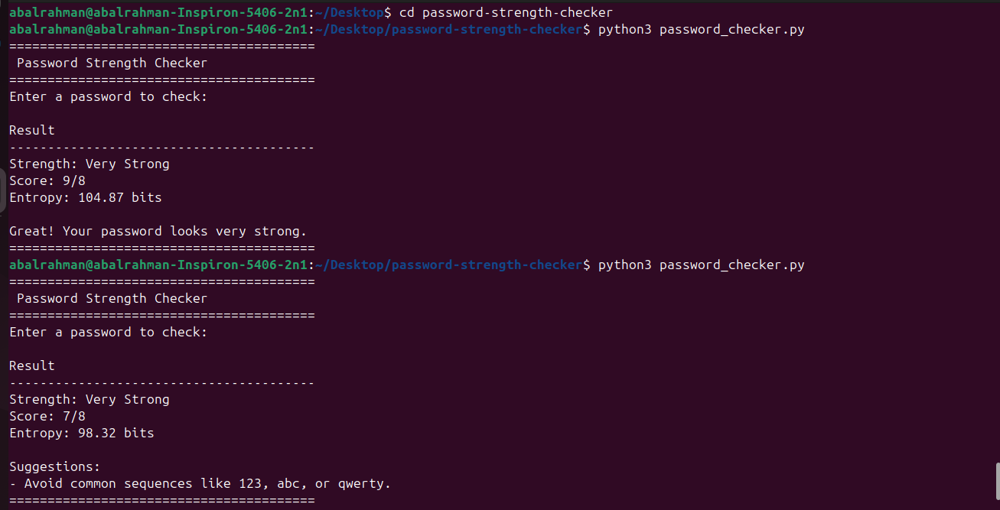

# Password Strength Checker

A simple Python security tool that checks password strength and provides improvement suggestions.

---

## Features

✅ Checks password length  
✅ Detects uppercase letters  
✅ Detects lowercase letters  
✅ Detects numbers  
✅ Detects special characters  
✅ Gives password strength rating  
✅ Provides improvement suggestions  

---

## Strength Levels

- Weak
- Medium
- Strong

---

## Technologies Used

- Python
- Regular Expressions
- Cybersecurity Basics

---

## Project Structure

```bash
password-strength-checker/
│
├── password_checker.py
├── screenshots/
└── README.md
```

---

## Installation

Clone the repository:

```bash
git clone https://github.com/abooobasil752-arch/password-strength-checker.git
```

Enter the project folder:

```bash
cd password-strength-checker
```

Run the script:

```bash
python3 password_checker.py
```

---

## Example Output

```bash
Password Strength: Strong

Great! Your password looks strong.
```

---

## Screenshots



---

## Future Improvements

- GUI version
- Password generator
- Data breach check
- Password entropy score
- Web version

---

## Author

Abdulrahman  
Computer Information Systems Student  
Cybersecurity & Python Enthusiast
